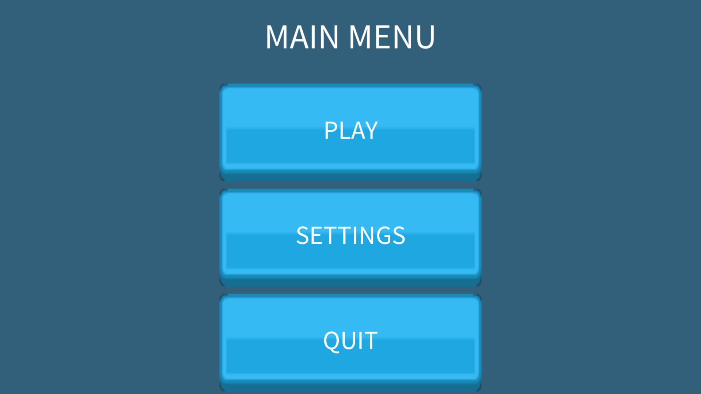
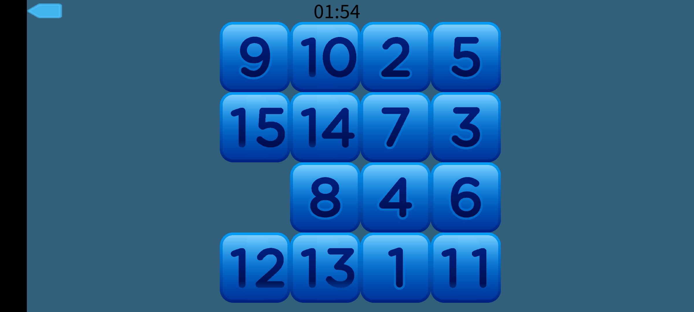

# FifteenPuzzle
An implementation of the 15-Puzzle game using Android and OpenGL ES: 

*Screenshot showing the main menu*

*Screenshot showing the main game interface*

The game uses assets that belongs to different sources: 
The grid numbers are taken from https://opengameart.org/content/numbers-blocks-set-01 by GameArtForge 
The UI elements are taken from https://opengameart.org/content/ui-pack by Kenney

